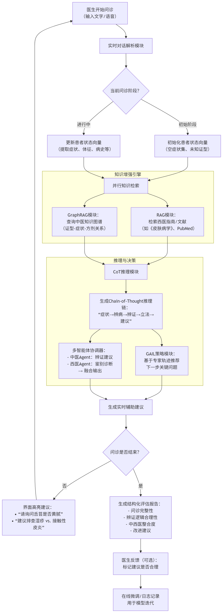
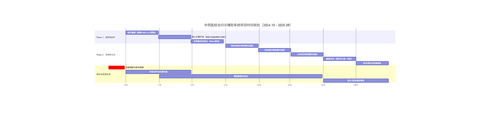

---

# 中西医结合辅助诊疗大模型 Capstone 项目

---

## 1. 项目概述（Introduction）

### 背景与目标  
中西医结合诊疗强调“病证结合”，在皮肤病等慢性病管理中具有独特优势。然而，临床实践中常面临辨证标准模糊、知识体系割裂、问诊路径不规范等问题。本项目旨在构建一个**AI驱动的中西医结合问诊辅助系统**，在医生与患者对话过程中**实时分析问诊逻辑、检测事实偏差、推荐关键问题或辨证方向**，从而提升诊疗规范性与准确性。

> **注意**：本系统**不扮演病人**，而是作为“智能协作者”嵌入真实问诊流程，提供**过程级反馈**（如：“您尚未询问皮损是否渗出，建议补充以鉴别湿热证”）。

### 核心功能  
- **实时对话理解**：解析医患对话中的症状、体征、病史等信息；
- **中西医知识对齐**：自动映射西医症状 ↔ 中医证型（如“红斑+瘙痒+口苦” → “风热证”）；
- **问诊完整性检测**：基于标准诊疗路径，识别缺失的关键问题；
- **动态建议生成**：推荐下一步应问的问题、需鉴别的证型或检查项；
- **过程评估报告**：问诊结束后生成结构化评估（覆盖辨证逻辑、中西医整合度等维度）。

### 创新点  
1. **RAG + GraphRAG 双引擎知识增强**：融合结构化中医知识图谱与非结构化西医文献，实现跨体系语义对齐；
2. **长链路 Chain-of-Thought（CoT）推理**：模拟“症状→辨病→辨证→立法→处方”完整中医思维链；
3. **对抗式模仿学习（GAIL）**：通过真实专家问诊轨迹训练，使模型学会“何时问什么”；
4. **多智能体协作架构**：中医智能体与西医智能体独立推理后融合建议，模拟多学科会诊；
5. **过程导向评估机制**：不仅关注诊断结果，更评估问诊逻辑的完整性与合理性。

### 预期成果
1. **本学期内**: 
    - 完成皮肤病知识图谱的构建；
    - 搭建皮肤病诊疗专家Agent；
    - 用于辅助诊疗的explainable AI system；
    - 可使用的简单web应用；
2. **项目完成时**:
    - **技术成果**：
      - 1套支持多病种的中西医结合问诊辅助系统（Web端）
      - 4个专科知识库（皮肤病、消化、妇科、儿科）
      - 开源GraphRAG构建工具链（针对中医典籍）
    - **学术成果**：
      - 技术报告 / 会议论文（如AMIA、NeurIPS ML4H）
      - 可复现的CoT+GAIL医学问诊训练框架
### 范围  
- **初期聚焦皮肤病**（湿疹、痤疮、银屑病等），因其症状直观、中西医诊疗路径清晰；
- 验证可行性后，扩展至消化科、妇科等病证结合成熟的领域。
---

## 2. 总体实现架构（Overall Implementation Architecture）

### 系统架构（三层设计）

#### **数据层**
- **西医知识源**：
  - 教科书：《安德鲁斯皮肤病学》《中国临床皮肤病学》
  - 文献：PubMed、arXiv 医学论文
  - 数据集：ISIC（皮肤影像）、SD-198（中文皮肤病图像+标签）
- **中医知识源**：
  - 典籍：《外科正宗》《医宗金鉴·外科心法要诀》
  - 教材：《中西医结合皮肤性病学》
  - 医案：合作医院脱敏真实病历（含四诊信息、方药、疗效）
- **多模态对齐数据**：
  - 图像-文本对（皮损照片 + 西医描述 + 中医辨证）
  - 医患对话日志（来自 CMDD 等中文医疗对话数据集）

> **预处理重点**：构建“西医症状 ↔ 中医证候”映射表，作为 GraphRAG 的边关系。

#### **模型层（核心创新区）**
| 模块 | 功能 | 技术实现 |
|------|------|--------|
| **RAG 检索器** | 从非结构化文献中检索相关西医指南/研究 | Dense Retrieval（如 Sentence-BERT） + LLM 重排 |
| **GraphRAG 引擎** | 从中医知识图谱中推理证型-治法-方剂路径 | Neo4j + LLM-based graph query（如 Cypher 生成） |
| **CoT 推理模块** | 生成可解释的诊断推理链 | 结构化提示 + LLM（如 LLaMA-3-8B） |
| **对抗学习模块（GAIL）** | 学习专家问诊策略 | 状态=当前问诊上下文，动作=推荐问题，奖励=专家轨迹相似度 |
| **多智能体协调器** | 融合中医/西医建议 | 基于置信度加权或辩论机制（如 Agent Debate） |

#### **应用层**
- **Web/移动端界面**：医生输入或语音转写对话，系统实时高亮建议（如侧边栏提示：“建议询问舌苔颜色以辨湿热”）；
- **评估报告生成器**：问诊结束后输出 PDF 报告，含问诊覆盖率、辨证准确率、改进建议；
- **反馈闭环**：医生可标记建议是否合理，用于在线微调。

### 工作流程
1. 医生开始问诊（文字/语音）；
2. 系统实时解析对话，更新患者状态向量；
3. **RAG + GraphRAG 并行检索**中西医知识；
4. **CoT 模块生成当前推理链**（如：“患者主诉瘙痒剧烈、皮疹色红 → 风热证可能性高 → 需确认是否伴发热、脉浮数”）；
5. **GAIL 模块推荐下一步问题**（如：“请询问是否怕风、有无发热”）；
6. 多智能体协调器输出最终建议；
7. 问诊结束，生成评估报告。

### 工作流程图

### 扩展性设计
- 知识库插件化：新增科室只需注入对应知识图谱 + 文献库；
- 模块解耦：RAG/GraphRAG/CoT 可独立升级。

---

## 3. 技术架构与技术选型

### 核心技术栈
| 组件 | 选型 | 说明 |
|------|------|------|
| **基座模型** | LLaMA-3-8B / Qwen2-7B | 开源、支持中文、适合微调 |
| **RAG 框架** | LlamaIndex + LangChain | 支持混合检索（向量 + 关键词） |
| **GraphRAG** | Neo4j + LLM-based Cypher Generator | 构建“证型-症状-方剂”三元组图谱 |
| **CoT 训练** | 结构化提示 + SFT + DPO | 使用教材/指南生成 CoT 样本 |
| **对抗学习** | GAIL 实现（基于 Stable Baselines3） | 状态空间=对话历史嵌入，动作空间=预定义问题集 |
| **多智能体** | LangGraph / AutoGen | 支持智能体间消息传递与决策融合 |
| **部署** | FastAPI + React + Whisper（语音） | 轻量级，支持医院内网部署 |

### 关键技术说明

#### **RAG + GraphRAG 融合机制**
- **RAG**：处理最新西医指南、药物禁忌等非结构化知识；
- **GraphRAG**：处理中医辨证逻辑（如“湿热证 → 龙胆泻肝汤 → 忌辛辣”）；
- **融合策略**：LLM 作为“仲裁者”，综合两者输出生成最终建议。

#### **长链路 CoT 与可解释性**
参考 **X-Ray-CoT**（arXiv:2508.12455）思路，将问诊过程分解为：
> **发现阶段**（识别症状） → **推理阶段**（辨病+辨证） → **决策阶段**（建议检查/治疗）  
每步生成自然语言解释，供医生审查。

#### **对抗式学习（GAIL）实现**
- **专家轨迹**：来自合作医院的标准化问诊录音（转文本）；
- **智能体策略**：基于当前对话状态，从预定义问题库中选择最优问题；
- **训练目标**：最小化智能体行为与专家行为的分布差异（JS 散度）。

---

## 4. 可行性分析与风险管理

### 技术可行性
- **RAG/GraphRAG**：LlamaIndex、Neo4j 社区成熟；
- **CoT**：X-Ray-CoT 等工作已验证医学 CoT 有效性；
- **GAIL**：在机器人、游戏领域广泛应用，医学对话可简化状态空间。

### 数据可行性
- 初期使用教材+公开数据集构建合成轨迹；
- 后期通过医院合作获取真实问诊数据（需伦理审批）。

### 风险与应对
| 风险 | 应对 |
|------|------|
| 中医知识图谱构建成本高 | 聚焦皮肤病，限定证型数量（≤5/病种） |
| 实时性要求高 | 采用缓存机制 + 轻量化模型（如蒸馏版 LLM） |
| 医生信任度低 | 强调“建议非强制”，提供 CoT 解释链 |

---

## 5. 项目阶段规划（12周）
### ▶ Phase 1：皮肤病专科MVP构建（Month 1–3）

| 月份 | 核心任务 | 交付物 |
|------|--------|--------|
| **M1** | **知识基建** - 构建皮肤病中西医知识图谱（证型-症状-方剂） - 集成西医文献RAG库（教材+PubMed） - 设计CoT推理模板（参考X-Ray-CoT思路） | - Neo4j图谱（≥50节点） - RAG检索测试集 - CoT提示词模板 |
| **M2** | **核心引擎开发** - 实现RAG + GraphRAG融合推理 - 微调LLM支持皮肤病CoT生成 - 搭建GAIL仿真环境（合成专家轨迹） | - 可运行推理API - CoT报告样例 - GAIL训练框架 |
| **M3** | **系统集成与验证** - 开发Web界面（实时建议+评估报告） - 内部测试（5–10名医学生） - 专家评审（2–3位中西医皮肤科医生） | - MVP系统 - 用户反馈报告 - 评估指标（问诊覆盖率、建议采纳率等） |

> ✅ **成功标准**：系统能对湿疹/痤疮等病症的问诊过程提供合理建议，并生成可解释评估。

---

### ▶ Phase 2：多病种泛化与框架固化（Month 4–8）

| 月份 | 核心任务 | 交付物 |
|------|--------|--------|
| **M4** | **扩展消化科** - 构建消化系统知识图谱（如“肝郁脾虚→逍遥散”） - 对齐西医诊断（如IBS、慢性胃炎） - 复用并微调现有CoT/GAIL模块 | - 消化科知识库 - 跨病种CoT适配方案 |
| **M5** | **扩展妇科** - 构建妇科辨证体系（肾虚、血瘀、肝郁等） - 整合激素检查、B超等西医指标 - 优化多智能体协调逻辑 | - 妇科知识库 - 多模态（文本+检查）融合策略 |
| **M6** | **扩展儿科** - 聚焦小儿常见病：感冒、咳嗽、厌食、积滞、夜啼 - 引入“小儿生理病理特点”（如“脾常不足”“肺常不足”） - 构建家长代述 → 医生问诊的语义转换逻辑  - 强化喂养史、生长发育史等关键问诊维度 | - 儿科知识库 - 家长-医生对话模块适配 -小儿辩证CoT模板 |
| **M7** | **框架泛化与优化** - 抽象“病种适配器”接口 - 支持一键切换科室 - 优化推理速度与建议精准度 | - 插件化架构文档 - 统一评估指标体系 |
| **M8** | **综合测试与成果固化** - 多科室交叉测试 - 编写技术白皮书 - 准备开源/论文/临床合作提案 | - 多病种演示系统 - 项目总结报告 - 扩展路线图（至全科） |

> ✅ **成功标准**：同一套系统可无缝支持皮肤病、消化科、妇科、儿科等疾病的问诊辅助，且各科评估指标达标。
---

## 6. 关键策略保障泛化能力

1. **知识解耦**：每个病种的知识图谱与RAG库独立存储，通过“病种上下文”动态加载；
2. **CoT模板参数化**：将“辨证维度”“关键问题集”“鉴别诊断列表”设为可配置项；
3. **GAIL轨迹池共享**：不同病种的专家轨迹统一格式，支持跨病种策略迁移；
4. **评估指标标准化**：定义通用维度（如“四诊完整性”“中西医整合度”），各科填充具体细则。

---

## 7. 预期成果

- **技术成果**：
  - 1套支持多病种的中西医结合问诊辅助系统（Web端）
  - 4个专科知识库（皮肤病、消化、妇科、儿科）
  - 开源GraphRAG构建工具链（针对中医典籍）
- **学术成果**：
  - 技术报告 / 会议论文（如AMIA、NeurIPS ML4H）
  - 可复现的CoT+GAIL医学问诊训练框架
- **应用前景**：
  - 教学：用于中医院校临床技能训练
  - 临床：嵌入电子病历系统，辅助基层医生

---
