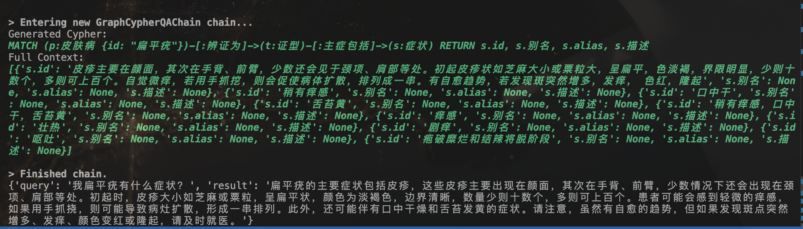

- 目前进度：
1. 完成了数据收集，完成中西医教材的数据收集，并完成了皮肤病图片训练集的收集
2. 基于皮肤病中医诊疗学构建了graphRAG
- 节点包含皮肤病243种，证型545种，症状1488种，方剂1000余种
- 关系包括：
    - 皮肤病-[辨证为]->证型-[主症包括]->症状
    - 证型-[治法为]->方剂-[用于治疗]->皮肤病

3. 初步构建了graphRAG索引的代码，可以正确的查询出结果，不过prompt仍然需要调整，目前仅能查询出结果。
    
    
    

# 西医 RAG 模块开发进展报告

## 1. 概述

本板块完成了西医领域检索增强生成（Retrieval-Augmented Generation, RAG）问答系统的初步构建，聚焦于皮肤病学方向，基于《中国临床皮肤病学》构建本地向量知识库，并集成大语言模型实现可解释的智能问答。

---

## 2. 核心工作内容模块介绍

### 2.1 知识源处理
- 加载《中国临床皮肤病学》纯文本文件并采用 `RecursiveCharacterTextSplitter` 进行分块：
- 原始文档共被切分为 **3965 个文本块**。

### 2.2 向量知识库构建
- 将知识文本向量化，储存在本地向量库`Chroma`，持久化至本地目录。嵌入模型选择了：`BAAI/bge-small-zh-v1.5‘
- 本地化数据库可以支持后续直接加载。

### 2.3 RAG 问答系统集成
- LLM 接入：通过阿里云API 调用 **Qwen-Max** 模型；
  - 将`temperature = 0`，以确保回答稳定性；
- 数据库检索配置设置如下：每次召回 **Top-3 最相关文本块**，并将检索结果拼接后输入模型；
- 这里特别启用了 `return_source_documents=True`，支持返回答案依据。

### 2.4 交互式终端界面
- 实现命令行循环问答：
  - 用户输入自然语言问题（如“皮肤红肿瘙痒可能是什么病？”）；
  - 系统实时返回结构化答案 + 参考原文片段;
  - 支持 `quit` / `exit` / `退出` 退出交互；
- 示例输出：
```
💡 答案： 皮肤瘙痒的治疗方法多种多样，具体选择哪种方法取决于引起瘙痒的原因。以下是一些常见的治疗手段：

1. **外用药物**：
   - 抗组胺剂：如5%多塞平软膏，可以封闭H1受体来缓解瘙痒。
   - 糖皮质激素：这类药物能有效减轻由炎症介质引起的皮肤病症状，但不建议长期使用，因为可能导致局部皮肤萎缩和干燥。
   - 免疫抑制剂：例如吡美莫司和他克莫司，对于某些特定类型的瘙痒（如移植物抗宿主病、酒渣鼻等）效果较好。
   - 锶盐：20%浓度的锶盐被证明能够抑制感觉刺激并止痒。
   - 辣椒辣素：通过影响P物质的相关过程来达到减缓瘙痒的效果。

2. **系统性治疗**：
   - 抗组胺药、钙补充剂、维生素C以及硫代硫酸钠等可用于辅助治疗。
   - 局部麻醉药物：如普鲁卡因可用于静脉注射以封闭全身性瘙痒；对于局限性瘙痒，则可考虑使用曲安缩松等地塞米松类药物进行局部封闭处理。
   - 沙利度胺：适用于治疗包括光化性痒疹在内的几种炎症性皮肤病。
   - 阿片受体拮抗剂：纳洛酮对胆汁性瘙痒有效，而纳呋拉啡与纳曲酮组合可用于血液透析患者的全身性瘙痒。
   - 5-羟色胺受体拮抗剂：昂丹司琼对淤胆性瘙痒有良好反应。
   - 加巴喷丁：特别适合于尿毒症性瘙痒患者，在每次透析后服用可以帮助减轻症状。

3. **物理疗法**：光疗（UVA、UVB或PUVA）对一些由系统性疾病导致的瘙痒具有疗效。

4. **中医中药**：采用养血祛风安神的原则进行调理，推荐使用的草药包括当归、川芎、白芍等。

请根据个人具体情况咨询医生，并遵循专业医疗人员的指导来进行治疗。如果瘙痒持续不见好转或者伴有其他严重症状，请及时就医检查。

📚 参考片段：
  [1] 3.外用抗组胺剂和外用糖皮质激素 5%多塞平软膏可以封闭H1受体而止痒。糖皮质激素可以有效地减轻由炎症介质介导的皮肤病，但不能长期使用，长期使用可以使局部皮肤萎缩和干燥。

4.免疫抑制剂 吡美莫司和他克莫司对移植物抗宿主病、酒渣鼻、结节性痒疹、硬化性萎缩苔藓、阴囊湿疹、单纯痒疹引起的瘙痒效果较佳。

5.锶盐等20%锶盐被证实有抑制感觉刺激和止痒作用，可以明显减轻组胺诱导的瘙痒，其机制尚不清楚，...
  [2] 3.根据相关疾病分类 瘙痒分为：① 皮肤病瘙痒，由各种皮肤病引起；② 系统性疾病瘙痒是与系统性疾病相关的全身性瘙痒；③ 特发性瘙痒指原因不明的瘙痒。

另外，根据部位，瘙痒分为局限性瘙痒和全身性瘙痒；根据病程，分为急性、慢性瘙痒；根据程度，分为轻、中、重度瘙痒。

二、瘙痒的病理生理学

（一） 瘙痒的神经生理学基础 皮肤全层分布着高密度的特异性感受器和传入神经纤维。交感神经仅占皮肤神经的一小部分...
👋 再见！
```